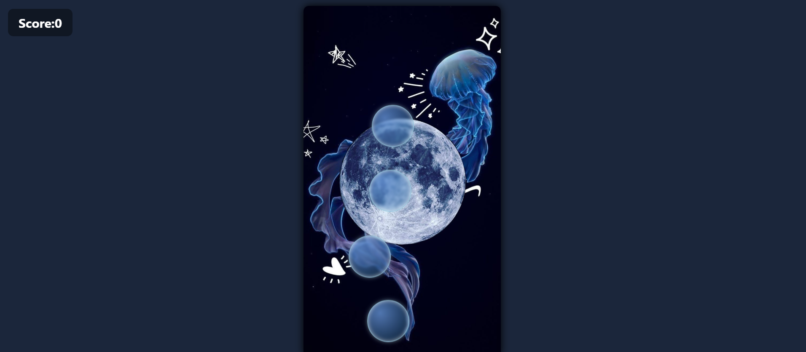

# Focus Bubble Game

A fun and engaging browser game where players pop floating bubbles to score points. The game ends if you miss a bubble, and the bubble speed increases every 10 points to challenge your reflexes!

---

## Features

- Pop bubbles with single or double clicks (double click works better)
- Increasing bubble speed as score increases
- Real-time score display
- Game over message with restart option
- Responsive and visually appealing design with smooth animations
- Sound effects on popping bubbles

---

## How to Play

1. Bubbles float up from the bottom of the screen.
2. Click or double-click on the bubbles to pop them and score points.
3. If you miss a bubble (it floats off the top), the game is over.
4. For every 10 points scored, the bubbles move faster.
5. Click the restart button to play again.

---

## Screenshot

---

## Technologies Used

- HTML
- CSS (animations & styling)
- JavaScript (game logic and event handling)

---

## Author

Aswini

---

Feel free to try it out and enjoy popping bubbles!
